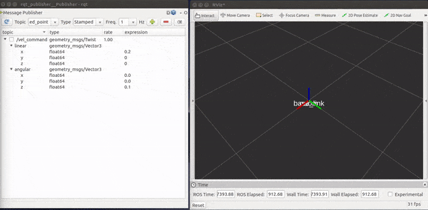
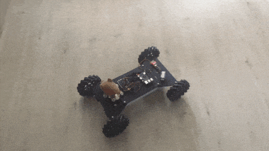

# Mobile_robot

Developing mobile robotic platform.

# Result of first stage development  
### test chassis  

### test odometry  

## Issues

PID not fine tuned. Can only reach (required_speed - 20 mm/s)

## Low level control

Mecanum wheels locomotion strategy. Using DJI Robomaster hardware.

- [x] mechanical design
- [x] motor control: communication via CAN bus
- [x] motion control: speed calculation
- [x] motion control: closed-loop velocity control
- [ ] provide IMU data for high level control
- [x] provide wheel odometry for high level control

## high level control

Developing laser-based SLAM in ROS.

- [ ] config ROS on Pi, communicate with MCU
- [x] robot modelling in URDF
- [x] acquire data from Lidar
- [x] robot physical modelling for simulation
- [ ] implement ros-control package
- [ ] implement gmapping package in Gazebo simulation environment
- [ ] implement navigation related package in Gazebo simulation environment
- [ ] implement gmapping package on real robot
- [ ] implement navigation related package on real robot
